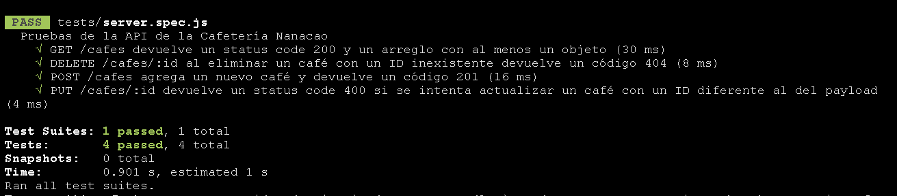

# Pruebas de la API de la Cafetería Nanacao

>Prueba de Testing de DesafioLatam para el módulo: Backend con Node y Express (G27).

Este repositorio contiene las pruebas unitarias para verificar el correcto funcionamiento de la API REST de la Cafetería Nanacao. Estas pruebas se realizan utilizando JEST y el paquete supertest.

## Requisitos

- Node.js
- npm

## Instalación

1. Clona este repositorio en tu máquina local.
2. Abre una terminal y navega hasta el directorio del repositorio clonado.
3. Ejecuta el siguiente comando para instalar las dependencias:

```
npm install
```

## Ejecución de las pruebas

1. Asegúrate de tener la API REST de la Cafetería Nanacao en funcionamiento.
2. En la terminal, dentro del directorio del repositorio, ejecuta el siguiente comando:

```
npm run test
```
Este comando ejecutará las pruebas y mostrará los resultados en la terminal.

## Estructura de las pruebas

El archivo `index.test.js` contiene las pruebas unitarias para las diferentes rutas de la API de la Cafetería Nanacao. A continuación, se describe cada una de las pruebas:

1. Prueba 1: `GET /cafes` debe devolver un arreglo con al menos un objeto.
   - Se verifica que la respuesta tenga un código de estado 200.
   - Se verifica que la respuesta sea un objeto.
   - Se verifica que exista al menos un objeto.

2. Prueba 2: `DELETE /cafes/:id` al intentar eliminar un café con un ID inexistente debe devolver un código 404.
   - Se envía una solicitud DELETE con un ID inexistente.
   - Se agrega un token (de prueba) dado que la aplicación solicita una autorización.
   - Se verifica que la respuesta tenga un código de estado 404.

3. Prueba 3: `POST /cafes` debe agregar un nuevo café y devolver un código 201.
   - Se envía una solicitud POST con los datos de un nuevo café.
   - Se verifica que se ha agregado un objeto al listado de cafés.
   - Se verifica que la respuesta tenga un código de estado 201.

4. Prueba 4: `PUT /cafes/:id` debe devolver un código 400 si se intenta actualizar un café con un ID diferente al del payload.
   - Se envía una solicitud PUT con un ID existente pero diferente en el payload.
   - Se verifica que la respuesta tenga un código de estado 400.

## Registro de la ejecución

La conclusión de las pruebas es que se verificó el correcto funcionamiento de las diferentes rutas de la API de la Cafetería Nanacao. Se deja registro de la ejecución de los tests en la siguiente imagen:

